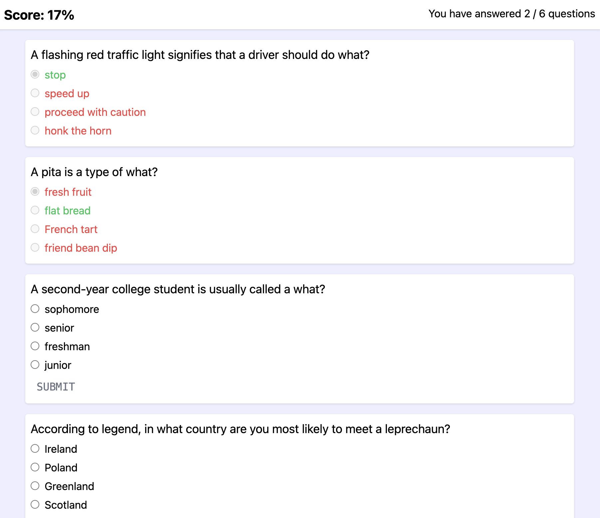

# Vue Example

A simple quiz/trivia app written in Vue to demonstrate some Vue concepts.



## Talking Points

The things that I think are most essential to know about Vue. Some of these I will compare to React for the purpose of understanding.

The code in this repository is written using the Vue Composition API - which is one of two ways to write the script sections that favors composition & code resuability. This is the method recommended by the docs, it has many benefits (especially for large projects) which probably won't be discussed here.

For reference, the other way being the Options API, which works a bit more like inheritance. (It has some drawbacks in large apps that make the code harder to manage or simply resue ... in my opinion)

### Components

- in Vue, components are written as single file components (SFC). These end in the `.vue` extension
- Each component has three sections:
  - Template
  - Script
  - Style

#### Template

This is where the HTML code gets written. Vue provides a number of handy directives and syntax-sugar that make this part really clean.

#### Script

This is where the logic of the component is written. Define state, actions, etc...

#### Style

This section is to define CSS (or SCSS/SASS if installed & configured).  
This can be optionally scoped to the current component (and usually is) - meaning any classes / rules defined will apply ONLY to the current component, not the whole app.  
You can even include both scoped AND non-scoped style sections if you need.

### Reactivity System

- Vue reactivity at it's core is not really like React - @vue/reactivity is actually a separate package that can be used without Vue components. Just on it's own.
- Alpine.js actually uses the vue reactivity package for its reactivity, without any Vue component code.
- This means you can actually use your Vue reactive state anywhere, and write more code that isn't strictly tied to your components.
- Unlike React, you don't need to call setter functions (`setState`) to make sure your components update. "It just works".

### Directives

#### v-if

Conditionally rendering content can be done in the template with the `v-if` directive. You pass a boolean expression to determine if an element should render or not. Vue also has a `v-else-if` and `v-else` directives that be used how you would expect on adjacent sibling elements

In React, you would typically do something like:

```jsx
<div>
  {someCondition && <p>my content</p>}
  {!someCondition && <p>some other content</p>}
</div>
```

Vue:

```html
<div>
  <p v-if="someCondition">my content</p>
  <p v-else>some other content</p>
</div>
```

#### v-for

Vue provides the `v-for` directive for looping over lists when rendering. In React (JSX) you would write some sort of `array.map(item => (<p>some content<p>))` expression within your template to render a list.

In Vue, just use v-for:

```html
<ul>
  <li v-for="item in items">{{ item }}</li>
  <!-- OR, if you want the index -->
  <li v-for="(item, index) in items">{{ item }}</li>
</ul>
```

You can do the same with objects, and it will loop over the (value, key) pairs of the object.

(It is recommended that you provide a key, similar to in React to help with rendering optimization)

### State

#### Passing Down

Vue uses a "props" system that is very similar to React to pass data down to child components. Data passed through props is treated as read-only.

#### Passing Up

Vue passes data up to parent components by emitting events. A child component emits an event with a name, and optionally data. A parent component can 'catch' these events by name and run whatever handler function is needed.

#### Two-Way data binding

Vue has a special solution for state in a component that needs to be passed down, and have changes to the same value passed up.
E.g. a value for a text box / input field. You need to define it in "your" component, but some input element/component is going to render the text box, and pass up the new value(s) of the string.

Vue uses a special binding called "v-model" which combines props & emits for a value, and allows the child to modify the value, and it will sync to the parent component. You no longer have to define multiple things to pass data around 'vertically'

### Slots

In cases where you need to define the content of a child component (like a grand-child component) - Vue has slots.

In React, this is like using `props.children`, or passing a component as a prop value.

Vue allows components to define slots with a name (and a default, unnamed slot), and parent components can write HTML to fill these slots in a way much more similar to normal HTML.

E.g. Child Component

```html
<div class="card">
  <slot />
  <!-- OR named -->
  <slot name="content" />
</div>
```

Parent Component

```html
<ChildComponent>
  <p>some default content</p>
  <!-- OR named -->
  <template #content>
    <p>elements for the content slot</p>
  </template>
</ChildComponent>
```

### Scoped Slots

Components can also pass data through slots.

Child Component:

```html
<ul>
  <li v-for="item in items">
    <slot name="entry" :item="item" />
  </li>
</ul>
```

Parent Component

```html
<ChildComponent :items="someListOfItems">
  <template #entry="{ item }">
    <span>{{ item.name }}</span>
  </template>
</ChildComponent>
```

### Other misc Points

- Just like how you can mount any React component anywhere in the DOM, you can create a new Vue app (as many as you want), with and Vue component as the root and mount it to any element in the DOM.
